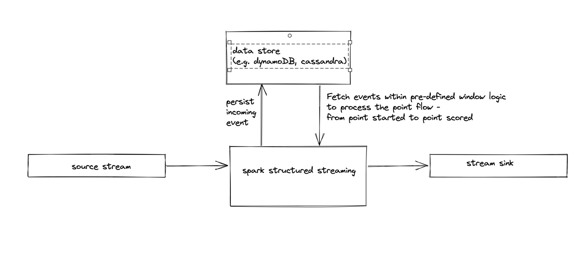

# imgarena tech task
to run:
`./gradlew run`

The above command will run the app and generate results for the relevant functional requirements in json files under `spark_output` directory. Note that the files are randomly named as they are generated by spark. To get around this limitation, each file is placed inside a directory with human friendly naming.

to test:
`./gradlew test`

### Side notes:
### Functional requirements
- I've tried to fulfill as many require as I could, given the time constraint.
- I've implemented the first three functional requirements (flatten, enrich, and fix missing data), but I didn't have time to implement the fourth R&D requirement. 
- If I had more time, I would've looked into adding serve speed and direction information as this might be useful to the end user - including myself - but can also be useful for further downstream analysis - e.g. finding patterns between first and second serves. As this data point is not available in the source data, I'd have to fetch it from an external data source.

### Non-functional requirements
- The first non-functional requirement states that the solution should be streamable and process the source data one event at a time. As I went for spark in my solution I've used spark structured streaming to consume the data from a streaming source like kafka, kinesis, s3 and produce the events to a similar streaming sink. One potential problem is that requirements 1 and 2 entails a stateful processing backed by a state store, hence I think it's infeasible to process the events one at a time. If processing individual events is a strict requirement, One possible solution is to have a data store with TTL configured and for each incoming event: 1) persist each event and 2) define a windowing logic to be able to fetch the relevant preceding and succeeding events to be able to build up the point flow. The following diagram depicts this idea:

  
- The second non-functional requirement is about cloud architecture. If we adapt the above diagram, I would define IAC in terraform. So say if you're using confluent kafka for your streaming. There is confluent terraform modules to create topics, ACls etc. If you're running your spark streaming job on EMR along with S3 for checkpointing, this could be defined in terraform as well. On top of that, common operations like IAMs and networking would be defined in terraform.

- The third requirement is a data contract. Ideally, I'd use a schema registry with avro format to accomplish this. The benefits of avro is schema backward compatibility and the compressed payload compared to json. 
  The idea is that for consuming events, the app will only process events with valid compatible schemes from the registry. The app will also send invalid events to a dead letter queue to notify upstream producers of the such invalid events.
  For producing events, the app should only produce events with schemas that are present in the registry and backward compatible. So in short, having a schema registry will enforce a data contract between producers and consumers with minimal friction.